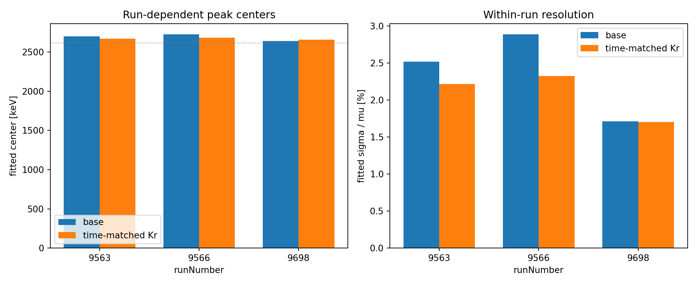

# PandaX-4T 能量重建与分辨率优化

**用标定数据识别 S1/S2 的残余响应，再检验能谱是否真正变窄。**

本项目记录一次暑期研究：从能量组合与多变量模型出发，经分组验证、时间留出和本底检查，逐步转向时间匹配的 Kr 标定。研究材料截至 **2026-08-22**。这里集中展示研究思路、最新证据和可运行流程，完整历史材料另有索引。

[下载最新整理包](https://github.com/zihengfan07/PandaX4T-Energy-Reconstruction/releases/latest) · [查阅完整历史材料](history/README.md)

*A student research project on liquid-xenon detector response and energy reconstruction. Includes traceable results, a synthetic-data demo, and the historical research archive. Raw detector data are not distributed.*

## 先看这三件事

| 想了解什么 | 从这里开始 |
|---|---|
| 做了什么，为什么这样做 | [研究方法](docs/METHOD.md) · [研究路线与取舍](docs/RESEARCH_HISTORY.md) |
| 得到了什么，证据是否充分 | [结果解读](docs/RESULTS.md) · [验证边界](docs/VALIDATION.md) |
| 如何亲手运行 | [无数据演示与实验复现](docs/REPRODUCING.md) |

## 最重要的发现

全部时期共用的 Kr 残差模型未达到预设改善门槛。按时间邻近关系匹配 Kr 与 2615 keV 数据后，两个早期 run 的拟合分辨率改善更明显，另一个 run 的改善尚不确定。

| 2615 keV 样本 | 修正前 σ/μ | 修正后 σ/μ | 相对改善 | 150 次重采样的改善区间 |
|---|---:|---:|---:|---:|
| run 9563 | 2.516% | 2.218% | 11.84% | 7.10%–17.35% |
| run 9566 | 2.887% | 2.323% | 19.53% | 12.43%–23.86%¹ |
| run 9698 | 1.712% | 1.702% | 0.56% | −2.11%–2.42% |
| 合并样本 | 2.278% | 1.947% | 14.54% | 11.73%–17.12% |

¹ run 9566 只有 110/150 次重采样被保留；其余被拟合失败或峰宽筛选排除，现有汇总未区分原因。区间只描述冻结修正后的事件重采样，不包括重新标定或模型选择的不确定性。



**结论是时间匹配的修正值得继续验证。** P1 时段 22.76% 的 S2 修正触及上下边界之一，且绝对峰位仍偏离标称能量。当前结果属于探索性候选，尚未完成全新 run 盲测。[查看完整解释和证据](docs/RESULTS.md)。

## 30 秒查看已保存结果

仅需 Python 3.10+，无需安装第三方库或取得实验数据：

```bash
git clone --depth 1 https://github.com/zihengfan07/PandaX4T-Energy-Reconstruction.git
cd PandaX4T-Energy-Reconstruction
python scripts/summarize.py
python scripts/check_project.py
```

摘要直接从原始汇总 JSON 计算；检查器核对证据文件指纹、文档链接和 Python 语法。

本轮已使用本地原实验数据复跑时间匹配与 150 次重采样；选中模型、八组峰拟合参数和四组区间均与归档一致。[检查记录](docs/CHECKS.md)。

## 运行一个完整的合成数据演示

```bash
python -m pip install -r requirements.txt
python scripts/demo.py --output local_results/demo
```

演示生成明确标记的人工 ROOT 数据，运行时间匹配修正及重采样，并输出图表与运行记录。**它用于验证程序和理解流程，不是 PandaX 实验结果。** 运行环境、输入格式及真实数据命令见[复现指南](docs/REPRODUCING.md)。

## 目录只保留阅读和运行所需的内容

```text
analysis/v21/     五个原始研究脚本，保留历史算法
docs/             方法、结果、验证、数据与复现说明
results/v21/      原始汇总 JSON 与六张关键图
scripts/          结果摘要、项目检查、输入检查和运行入口
tests/            入口与数据合同的针对性检查
history/          研究归档索引与报告阅读入口
```

[历史材料与报告馆](history/README.md)保留了早期至 v20 的代码、报告和模型说明入口。旧版 471 文件归档仍可完整下载，不再混在日常使用目录中。

本仓库是个人研究记录，不代表 PandaX 合作组的官方软件或结论；原始实验数据不公开。代码与材料的使用范围见[数据与发布说明](docs/DATA.md)。
