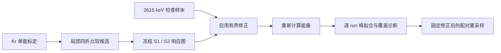

# 方法：从响应依赖到能量检查

## 1. 研究对象

S1 表示闪烁光信号，S2 表示电离电子产生的后续信号。这里使用的 `qS1_PCs`、`qS2Bdes_PCs` 已经过已有响应修正；目标是测量仍然残留的小幅依赖，而非重新定义整套探测器重建。

基础能量为

$$E_0=0.0137\left(\frac{qS1_{PCs}}{0.128755}+\frac{qS2Bdes_{PCs}}{8.6125}\right)\ \mathrm{keV}.$$

参数与输入分支保持原研究设置。[代码：能量公式与信号定义](../analysis/v21/kr_residual_correction_v21.py)。

## 2. 为什么使用 Kr 标定

在单能事件中，信号的系统性空间或漂移时间变化能够帮助识别响应不均匀。研究从 Kr 峰窗 37.75–44.75 keV 内的事件提取相对响应，考察 `dt`、S2 宽度及 x/y 位置。

这不意味着 Kr 单峰能决定全部高能能标：从低能到 2615 keV 的非线性需要多条已知能量峰另外约束。

## 3. 两条方案的区别

| 项目 | 全局残差方案 | 时间匹配方案 |
|---|---|---|
| 训练信息 | 全部时期的 Kr run | 时间邻近的指定 Kr run |
| 候选验证 | 将 Kr run 分为四组留出 | 在局部 Kr 峰窗内随机四折事件验证 |
| 修正形式 | 分位数分箱、中位响应、线性插值 | 同类响应图，使用更粗的局部分箱 |
| 模型选择 | 相对 R68 改善大于 0.001 才接受 | 相同门槛 |
| 输出信号因子 | 单项和累积修正均限制在 [0.97, 1.03] | 相同限制 |
| 本次结果 | 选择不做额外修正 | P1 选择 S2–dt；P2 选择 S1/S2–dt |

这里的 0.001 是相对改善比例，即 **0.1% 相对改善**，不是分辨率下降 0.1 个百分点。

## 4. 时间匹配与修正

| 时段 | Kr run | 2615 keV run | 选中依赖 |
|---|---|---|---|
| P1 | 9568 | 9563、9566 | 只修正 S2 对 dt 的残差 |
| P2 | 9685、9695 | 9698 | S1、S2 分别对 dt 修正 |

分箱中位响应经过归一化后，插值得到响应函数 R；乘法修正为 `clip(1/R, 0.97, 1.03)`。超出插值节点范围时，历史代码使用端点值延拓，这正是需要检查标定覆盖的原因。[时间匹配实现](../analysis/v21/time_matched_kr_v21.py)。

## 5. 如何评价效果

- **Kr 的 R68：**本版本使用 `(Q84−Q16)/(2×median)`，用于候选选择。
- **峰位 μ、峰宽 σ：**在 2450–2850 keV 区间，以 2.5 keV 分箱，拟合高斯峰加线性背景。历史实现使用 `curve_fit`，不是完整探测器响应似然。
- **相对分辨率 σ/μ：**越小不一定意味着绝对峰宽变小，因此必须同时报告 μ、σ。
- **配对 bootstrap：**每次对修正前后能量使用相同事件索引；不重新拟合 Kr 图，也不重新选择模型。
- **适用范围：**比较 dt 覆盖、修正边界命中率以及不同 run 的结果。

本轮没有修改历史算法，原始代码及汇总数值以 SHA-256 对照保存。严格验证仍有哪些不足，见[验证边界](VALIDATION.md)。
