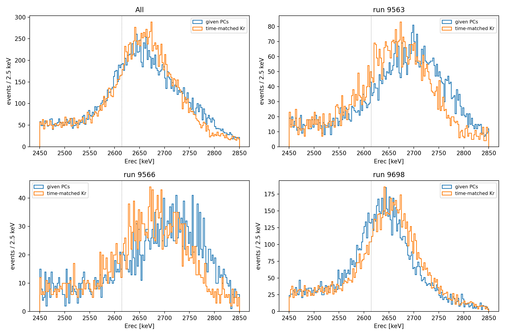
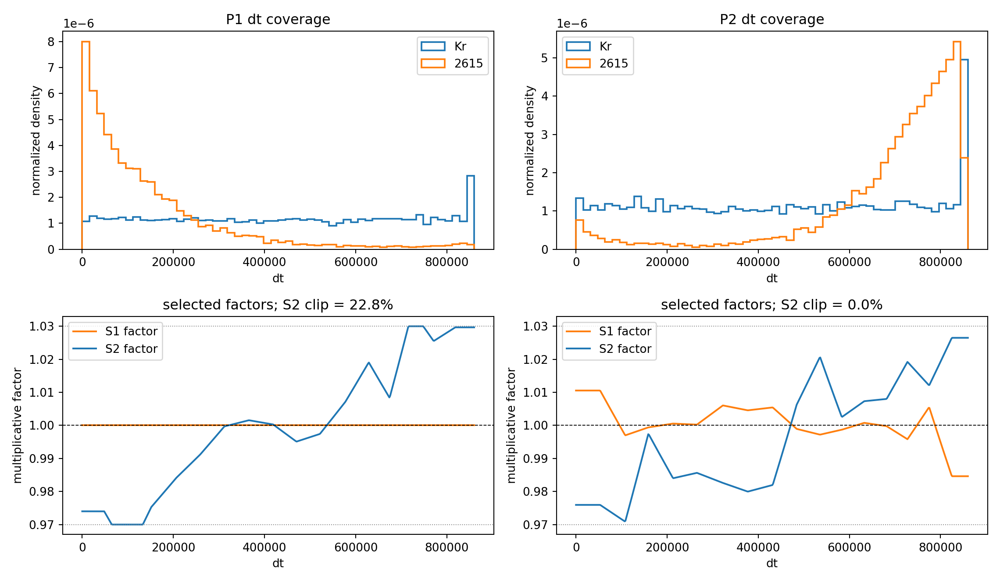

# 结果：改善在哪里，限制在哪里

以下数值引用保存的原始研究汇总。本轮本地复跑确认了这些结果，没有用复跑输出覆盖证据文件。运行 `python scripts/summarize.py` 可重新计算表格；复核记录见 [CHECKS.md](CHECKS.md)。

## 1. 全局方案未通过门槛

四组 Kr run 留出比较后，没有修正候选达到预设 0.1% 相对 R68 改善。程序选择 `M00_no_residual`。这个否定结果提示：在这些数据上，不能假设一个残差响应图能适用于所有采集时期。

依据：[全局候选结果](../results/v21/summary.json)，[候选比较图](../results/v21/01_kr_cross_validation.png)。

## 2. 时间匹配方案

P1 的 Kr 验证选择 `M01_s2_dt`，相对 R68 改善约 0.893%；P2 选择 `M03_both_dt`，约 0.148%。选择完成后，在相应高能样本上检查峰形。

| 样本 | μ 前→后 / keV | σ 前→后 / keV | σ/μ 前→后 | 相对改善 |
|---|---:|---:|---:|---:|
| run 9563 | 2701.46→2671.06 | 67.966→59.241 | 2.516%→2.218% | 11.84% |
| run 9566 | 2725.33→2684.87 | 78.681→62.376 | 2.887%→2.323% | 19.53% |
| run 9698 | 2640.75→2656.74 | 45.211→45.231 | 1.712%→1.702% | 0.56% |
| 合并 | 2658.87→2663.06 | 60.576→51.847 | 2.278%→1.947% | 14.54% |

run 9563/9566 的绝对峰宽和相对分辨率都下降。**run 9698 的绝对 σ 略增**，其 σ/μ 的小幅下降主要伴随着分母 μ 上升，不能据此宣称峰本身变窄。其重采样区间也包含零。

合并样本受到不同 run 峰位混合的影响，因此它不能替代逐 run 的分辨率结论。修正后的峰位仍未落在标称 2614.5 keV 上，响应修正与绝对能标是两个需要分别验证的问题。

依据：[原始拟合参数及局部响应图](../results/v21/time_matched_summary.json)。

## 3. 重采样描述的是什么

| 样本 | 计划次数 | 有效次数 | 相对改善 95% 分位区间 |
|---|---:|---:|---:|
| run 9563 | 150 | 150 | 7.10%–17.35% |
| run 9566 | 150 | 110 | 12.43%–23.86% |
| run 9698 | 150 | 150 | −2.11%–2.42% |
| 合并 | 150 | 150 | 11.73%–17.12% |

历史程序只保留拟合成功且前后 σ/μ 都处于 (0.005, 0.06) 的迭代。run 9566 的 40 次排除无法从现有汇总区分是拟合失败还是阈值筛选，因此区间是**条件于保留迭代**的结果。

JSON 中的 `probability_gain_positive` 是有效重采样中改善为正的比例，不是“模型正确的概率”，也不是显著性检验的 p 值。

依据：[bootstrap 汇总](../results/v21/time_matched_bootstrap.json)，[筛选与重采样实现](../analysis/v21/bootstrap_time_matched_v21.py)。

## 4. 覆盖与边界是当前最直接的限制

P1 的 S2 边界命中率是 **22.7627%**。原代码统计的是 `factor <= 0.970001 OR factor >= 1.029999`，即上下边界合计。旧叙述将其全部称为“下限命中”不准确；现有汇总并未分别给出两端比例。P2 的 S1/S2 边界命中率均为零。

低 dt 覆盖差异、端点延拓及 ±3% 截断都可能影响效果。现有证据支持进一步补充标定与检查，尚不支持直接放宽截断或宣布获得可部署的通用模型。

## 5. 主张与证据对应

| 可以支持的主张 | 直接证据 | 尚不能推出 |
|---|---|---|
| 全局候选没有跨过当前门槛 | `summary.json` 的候选比较 | 任何全局方法都无效 |
| P1 当前样本的拟合峰宽下降 | `time_matched_summary.json` 的逐 run 参数 | 新时期也一定改善 |
| run 9698 改善不确定 | bootstrap 区间跨零、绝对 σ 未降 | P2 修正已经有效 |
| P1 修正经常受边界约束 | `support.s2_clip_fraction` | 命中的事件全在下边界 |
| 当前统计区间有限 | 固定映射的事件重采样与有效次数 | 已覆盖标定、选模及时间系统误差 |

全部原始证据文件见[证据目录](../results/v21/README.md)，来源指纹见[provenance.json](../results/provenance.json)。
