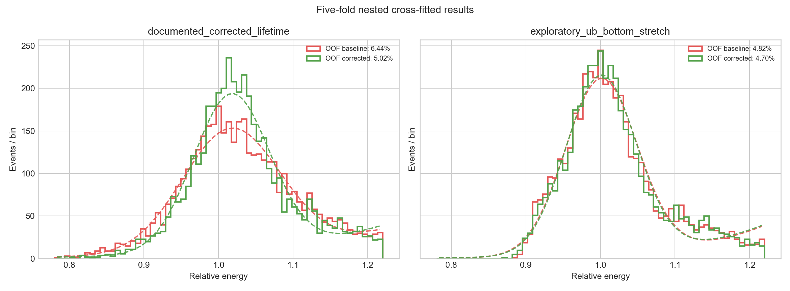

> 历史研究材料：文中的“当前/推荐”只代表该材料形成时的状态。最新结论与公开版范围请看[项目首页](../../../../README.md)。原始数据、逐事件输出和二进制模型不随公开版提供。

# 已被独立基础变量分析取代（历史探索报告）

本文件中的派生分支排名和 Gaussian-core 数字只保留作历史记录。峰形拟合优度
审计未通过，且 `E > 2 MeV` 预选公式未知；请以 `INDEPENDENT_REPORT.md`、
`INDEPENDENT_PROTOCOL.md`、`channel_physics_outputs/` 和
`basic_matrix_outputs/` 为当前结论。

# PandaX-4T Run 10972 能量分辨率探索报告

## 结论摘要

本阶段完成了数据质量审计、S1/S2 正权重扫描、峰与背景拟合、低自由度漂移时间/位置响应修正、按文件分组的五折嵌套交叉拟合，以及配对文件 bootstrap。

当前最重要的结论不是一个可直接发布的最终分辨率，而是两个可复现的分析事实：

1. 使用文档中能够解释的 `qS1C_max + qS2Belife_max`，五折交叉拟合的 Gaussian core 分辨率由 **6.44%** 改善到 **5.02%**。五个外层折均改善，说明旧分支中仍存在明显的 `dt` 和位置响应残差。
2. 未在现有 TechNote 中定义的 `qS1ub_C + qS2Bub_C_stretch` 本身已达到 **4.82%**，追加低自由度修正后为 **4.70%**。改善较小且一折轻微变差，说明 `ub/stretch` 很可能已经包含主要的均匀性修正。下一步应优先找到这些分支的生成代码和物理定义。

这些数值都是输入文件经过未知 `E > 2 MeV` 预选后的条件分辨率。源类型、峰能量、cut 语义和绝对能标尚未确认，因此不能把峰直接宣布为 2615 keV，也不能与公开论文中的 1.9%-2.3% 直接比较。

## 1. 数据审计

- 原始文件：4,500 个事件，188 个字段，仅包含 run 10972。
- 唯一事件键 `(runNumber, fileNumber, eventNumber)` 无重复。
- 为保证方法间公平比较，所有预先列出的候选分支使用共同有限掩码，保留 4,497 个事件；原始 TXT 未被修改。
- 9 个 `cdfTM/cdfPAF` 位置相关字段整列为 `NaN`。
- `qS1C_max` 系列有 2 个 `inf`；部分 MCPAF 派生字段有 1-3 个 `inf`。
- `xS2max_desCorCog_maxS2` 和对应 y 分支全为 0，不能作位置变量。本分析使用非零的 `xS2Tcor_max/yS2Tcor_max`，但仍需确认其定义。
- cut 标志不能统一解释为“1=通过”或“0=通过”：例如 `basicCut`、`S1PerPmtCut` 全为 1，而 `fv_extendCut`、`gas_s2Cut`、`wallCut` 全为 0。因此本阶段不额外应用 cut。

完整审计见 `outputs/variable_audit.csv` 和 `outputs/cut_flag_audit.csv`。

## 2. 能量估计与拟合方法

PandaX-4T 的公开高能基准形式为

\[
E = W\left(\frac{S1}{g_1}+\frac{S2_B}{g_{2B}}\right),
\qquad W=13.7\,\mathrm{eV},
\]

其中 `S2_B` 使用底部阵列以降低顶部高能 S2 饱和的影响。当前没有 run 10972 对应的可靠 `g1/g2B`，所以本阶段使用尺度不变的相对估计量

\[
e_\alpha=\alpha\frac{S1}{\operatorname{median}(S1)}
 +(1-\alpha)\frac{S2_B}{\operatorname{median}(S2_B)},
\]

并只允许两个权重为正。权重由内部训练/验证文件选择。

峰在相对能量 `[0.78, 1.22]` 内使用截断 Gaussian 信号加截断指数背景进行非分箱似然拟合。主指标为

\[
R_\sigma=\frac{\sigma}{\mu}.
\]

另外报告固定窗口内的中央 68.27% 半宽/中位数，防止 Gaussian core 模型单独决定结论。

## 3. 拆分和防止过拟合

- 事件按 `fileNumber` 分组，避免同一源文件泄漏。
- 五个外层折由 `fileNumber % 5` 定义。
- 每个外层折内部再留出一折选择 S1/S2 权重和修正序列。
- 修正仅从 `dt`、`r²`、`phi` 和 `fileNumber` 的等频箱局部峰心学习，不把单个单能事件回归到常数目标。
- 若某个更简单的修正与验证集最优值相差不超过 0.05 个百分点，选择更简单者。
- 每个事件的 OOF 能量均由不包含该事件的数据学习。

## 4. 分支比较

单次开发/测试切分中的预先指定比较如下，主要用来定位方向：

| 方法 | 测试集 core σ/μ |
|---|---:|
| S1-only `qS1C_max` | 8.64% |
| S2B-only `qS2Belife_max` | 8.20% |
| raw `qS1_max + qS2B_max` | 6.45% |
| corrected `qS1C_max + qS2Belife_max` | 6.26% |
| total-S2 `qS1C_max + qS2C_max` | 7.91% |
| MCPAF desaturated | 5.59% |
| `qS1ub_C + qS2Bub_C_stretch` | 4.75% |

S1/S2 组合优于两个单独通道，符合固定能量下的反相关预期。总 S2 明显差于底部 S2，也与高能分析优先使用底部阵列的公开方法一致。

两个额外检查很关键：

- `qS2Belife_max / qS2BC_max = 1.064133598`，事件间标准差仅约 `2.85e-8`。两者实际上只差常数能标，不能用它们比较事件级电子寿命修正效果。
- `qS2Bdesub_C_stretch / qS2Bub_C_stretch` 的均值约 `0.999991`；两分支几乎相同，当前数据中没有证据表明这个去饱和版本改善了分辨率。

## 5. 五折嵌套交叉拟合结果

### 5.1 可解释的文档分支

`qS1C_max + qS2Belife_max`：

| 阶段 | OOF core σ/μ | 中央68%稳健宽度 |
|---|---:|---:|
| 基准 | 6.44% | 7.64% |
| 低自由度修正后 | 5.02% | 6.49% |

各折选择的正权重 `alpha` 在 0.55-0.73 之间；修正主要选择 `dt+r²`，个别折在内部验证中加入 `phi`。五折的 core 分辨率改善分别为约 1.30、0.74、1.74、1.43、1.78 个百分点。

在固定交叉拟合预测上按 `fileNumber` 做 250 次配对 bootstrap：

- 分辨率比值中位数：0.781；95% 区间约 `[0.743, 0.818]`。
- 分辨率差中位数：-1.41 个百分点；95% 区间约 `[-1.71, -1.11]`。

这表明旧分支的响应残差是真实且稳定的，但不意味着该追加修正就是最终物理修正图。当前 4,500 个外部高能事件不足以制作正式三维响应图。

### 5.2 `ub/stretch` 探索分支

`qS1ub_C + qS2Bub_C_stretch`：

| 阶段 | OOF core σ/μ | 中央68%稳健宽度 |
|---|---:|---:|
| 基准 | 4.82% | 6.38% |
| 低自由度修正后 | 4.70% | 6.24% |

配对 bootstrap：

- 分辨率比值中位数：0.974；95% 区间约 `[0.962, 0.987]`。
- 差值中位数：-0.126 个百分点；95% 区间约 `[-0.187, -0.064]`。

五折中一折轻微变差、一折没有选择修正，其余三折小幅改善。因此追加修正的平均收益虽不为零，但远小于旧分支，且不够稳定，不能继续增加复杂度。



## 6. 拟合与系统学风险

- 改变相对拟合窗口会显著改变绝对 core σ/μ。例如单次切分的文档基准在不同窗口约为 5.04%-6.86%。因此最终结果必须固定物理能量窗口，并比较 Gaussian+指数、Crystal-Ball+背景等模型。
- 本报告的 bootstrap 是对已经冻结的 OOF 预测做配对文件重采样，没有在每次 bootstrap 中完整重做权重选择与响应图学习；区间属于条件统计区间，低估了全流程不确定度。
- 文件名表明数据在导出前经过 `E > 2 MeV` 预选。未知的预选估计量可能影响低能尾、背景和不同分支间的公平性。
- 外部源的 `phi` 覆盖很窄，不能据此制作全探测器角向响应图。
- 当前只有一个 run，不能验证跨 run 稳定性、能量线性或其他峰的表现。

## 7. 下一步优先级

1. 找到生成 TXT 的代码，确认 `qS1ub_C`、`qS2Bub_C_stretch`、`MCPAF`、`stretch`、`Belife` 和全部 cut 的精确定义。
2. 从 run log 确认 run 10972 的标定源、部署位置、目标峰和真实峰能量。
3. 确认 `Egt2MeV` 预选使用的变量和阈值；最好取得未做能量阈值预选的数据。
4. 获取当前数据期的 `g1`、`g2B`，或 PDE、EEE、SEGB，建立物理能标。
5. 用独立 run 复现 `ub/stretch` 基准；在新 run 上冻结权重和修正后再评价。
6. 获得更多均匀标定样本后，分别构建 S1 三维、S2 寿命加二维位置响应图；不要用这 4,500 个外部源事件直接制作精细图。
7. 最终峰拟合加入替代信号/背景模型和完整流程的分组 bootstrap。

## 8. 参考资料

- [PandaX-4T early MeV analysis, arXiv:2205.12809](https://arxiv.org/abs/2205.12809)
- [PandaX-4T updated energy reconstruction, arXiv:2409.00773](https://arxiv.org/abs/2409.00773)
- [PandaX-4T PMT saturation/desaturation study, arXiv:2401.00373](https://arxiv.org/abs/2401.00373)
- [PandaX-4T Run0/Run1 high-energy analysis, arXiv:2412.13979](https://arxiv.org/abs/2412.13979)
- [PandaX-II high-energy anti-correlation optimization](https://cpc.ihep.ac.cn/article/doi/10.1088/1674-1137/43/11/113001)

## 9. 复现

在数据文件所在目录运行：

```powershell
python .\energy_resolution_analysis\run_analysis.py
```

原始 TXT 始终只读。所有表格、图和 JSON 摘要写入 `energy_resolution_analysis/outputs/`。
